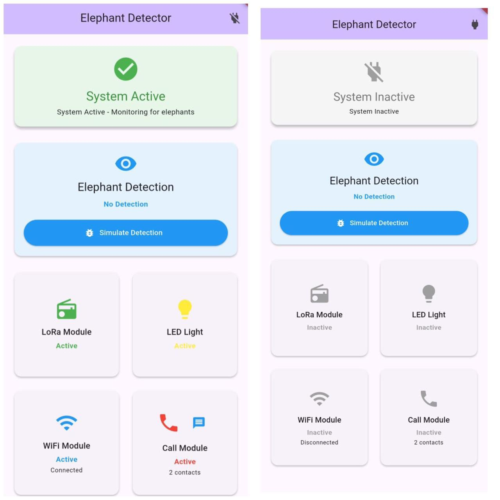
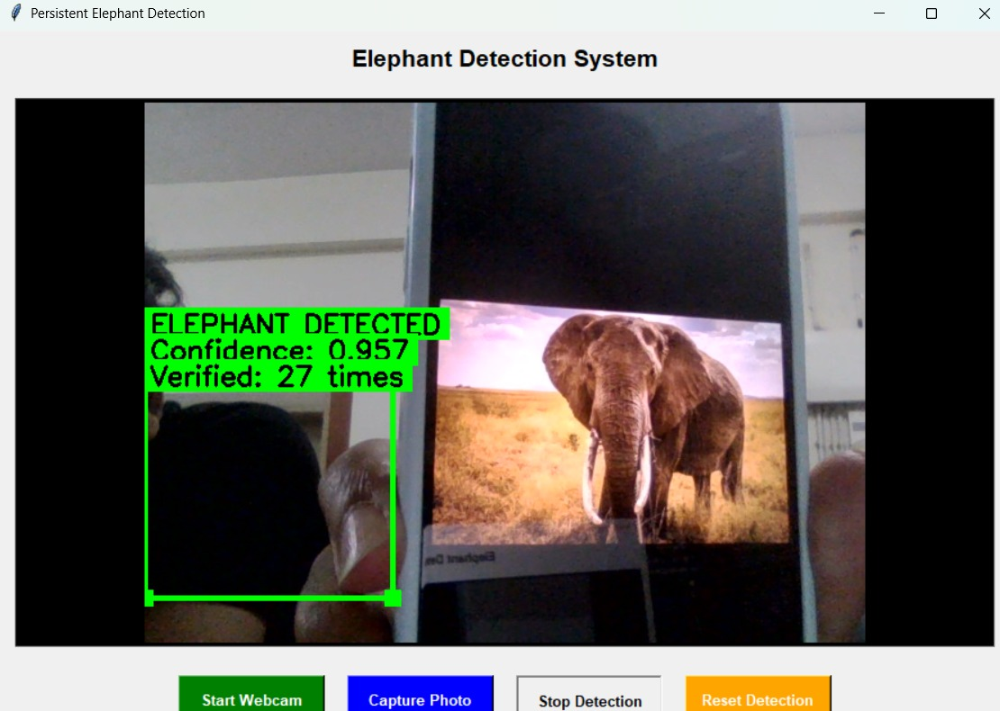
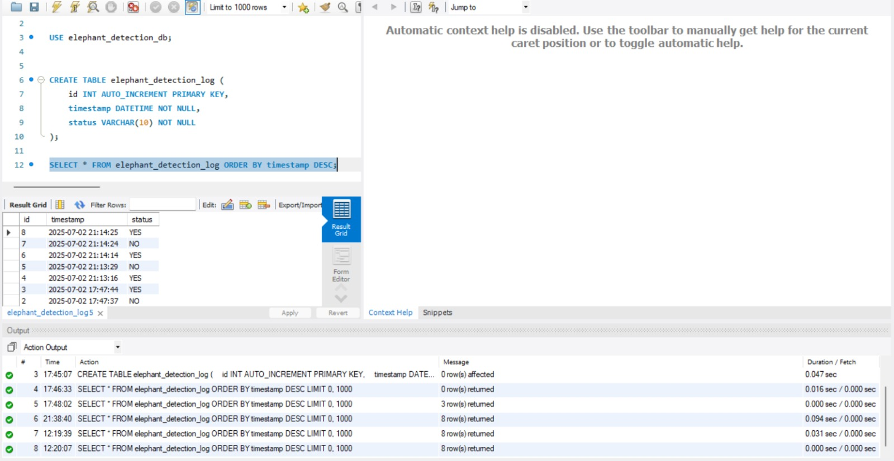

# **Elephant Detection and Alert System**

This project was developed as part of my undergraduate minor project to help reduce human-elephant conflict using artificial intelligence. The system detects elephants from images or live camera feeds using deep learning and computer vision techniques. It combines a CNN-based classifier with YOLOv5 object detection and stores detection records in an SQL database. The system is designed to run on a Raspberry Pi, making it suitable for real-time deployment in forest or rural areas.

---

## **Features**

- Detects elephants from images and live camera feeds.
- Uses a CNN model for elephant classification.
- Uses YOLOv5 for object detection.
- Stores detection details in an SQL database.
- Supports deployment on Raspberry Pi.
- Designed for real-time monitoring and alert generation.

---

## **Technologies Used**

- Python
- TensorFlow / Keras
- OpenCV
- YOLOv5
- SQL
- Raspberry Pi
- Flutter

---

## **Project Structure**

```text
Elephant-Detection-and-Alert-System/
│
├── dataset/
├── Elephant/
├── others/
├── screenshots/
├── cnn_train.py
├── main_working.py
├── DB.sql
├── yolov5s.pt
├── README.md
└── .gitignore
```

---

## **Installation**

### Clone the repository

```bash
git clone https://github.com/alisha-dash/Elephant-Detection-and-Alert-System.git
```

### Move to the project directory

```bash
cd Elephant-Detection-and-Alert-System
```

### Install the required packages

```bash
pip install -r requirements.txt
```

### Run the project

```bash
python main_working.py
```

---

## **Results**

- Successfully trained a CNN model for elephant classification.
- Integrated YOLOv5 for elephant detection.
- Stored detection details in an SQL database.
- Tested the system for real-time detection using Raspberry Pi.
- Achieved successful end-to-end execution of the detection pipeline.

---

## **Application Preview**

### **Mobile Application**

The Flutter mobile application provides a simple dashboard for monitoring the system. It displays the current system status, elephant detection status, and the status of the LoRa module, Wi-Fi module, LED indicator, and call module.



---

### **Elephant Detection**

The desktop application performs real-time elephant detection using a webcam. When an elephant is detected, the system displays the confidence score and verification count before confirming the detection.



---

### **Database Records**

Detection events are automatically stored in an SQL database with their timestamp and detection status. These records provide a history of detections for monitoring and future analysis.



---

## **Future Improvements**

Some enhancements that can be added in future versions include:

- SMS and email alert system
- GPS location tracking
- Cloud database integration
- Improved detection accuracy under different environmental conditions
- Support for additional wildlife species

---

## **Author**

**Alisha Dash**

GitHub Profile: https://github.com/alisha-dash

Repository: https://github.com/alisha-dash/Elephant-Detection-and-Alert-System
